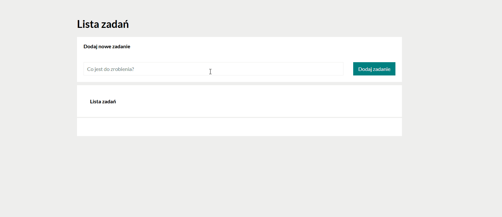

# To-Do-List

# About project
The project maked for course from YouCode.pl 
It is simple task list maked in HTML, CSS and Javascript
# How to use

# Demo
 https://widmo200.github.io/to-do-list/

# Features
- HTML
- CSS
- Javascript
- Bem convention
 # Contact
 [GitHub]https://github.com/widmo200